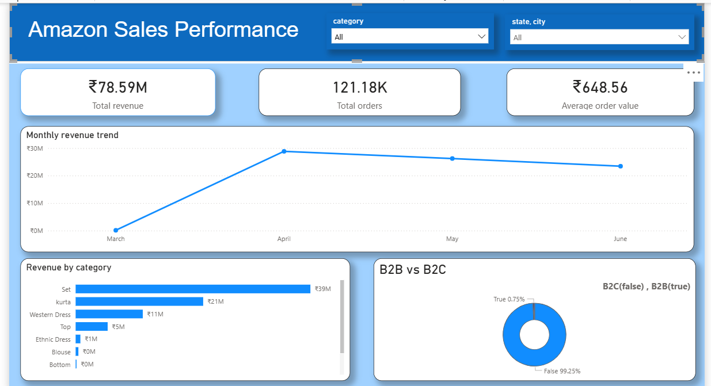

# 🧾 Amazon Sales Analysis 

*Analyzing e-commerce sales dynamics and fulfillment efficiency to drive revenue growth and market retention using Python, PostgreSQL, and Power BI.*

---
## 📌 Table of Contents
* [Overview](#overview)
* [Business Problem](#business-problem)
* [Dataset](#dataset)
* [Tools & Technologies](#tools--technologies)
* [Project Structure](#project-structure)
* [Data Cleaning & Preparation](#data-cleaning--preparation)
* [Exploratory Data Analysis (EDA)](#exploratory-data-analysis-eda)
* [Research Questions & Key Findings](#research-questions--key-findings)
* [Dashboard](#dashboard)
* [How to Run This Project](#how-to-run-this-project)
* [Final Recommendations](#final-recommendations)
* [Author & Contact](#author--contact)

---

## 📝 Overview

This project provides an end-to-end data analytics solution for **Amazon Sales Data**, aimed at uncovering key drivers of revenue and operational efficiency. 

The project involved building a robust data pipeline that transitioned raw sales records into actionable business intelligence. Key phases included:
* **ETL Pipeline:** Extracted and cleaned messy sales data using **Python (Pandas)**.
* **Database Management:** Designed and implemented a relational schema in **PostgreSQL** for structured storage and complex querying.
* **Statistical Analysis:** Conducted deep-dive analysis to identify seasonal trends and high-value product categories.
* **Visualization:** Developed an interactive **Power BI** dashboard to track KPIs such as total sales, profit margins, and regional performance.

---

## 💼 Business Problem

Effective e-commerce management requires a deep understanding of customer behavior, logistics, and revenue streams. This project addresses several key business challenges through data-driven analysis:

* **Customer Segmentation & Value:** Differentiating between **B2B and individual consumer** performance.
* **Operational Efficiency:** Comparing **Amazon vs. Merchant fulfillment** cancellation rates.
* **Strategic Growth Tracking:** Calculating **Month-over-Month (MoM) growth** across categories.
* **Revenue Optimization:** Categorizing transactions into **High, Medium, and Low-value tiers**.
* **Data Integrity:** Standardizing inconsistent regional data to ensure accurate reporting.

---

## 📊 Dataset

This project utilizes the [Amazon E-commerce Sales Dataset](https://www.kaggle.com/datasets/thedevastator/unlock-profits-with-e-commerce-sales-data) from Kaggle, containing approximately 129,000 transaction records focused on the Indian market.

---

## 🛠️ Tools & Technologies

* **Database & Data Extraction:** SQL (PostgreSQL)
* **Data Analysis & Scripting:** Python (Pandas, NumPy)
* **Visualization & Dashboarding:** Power BI, Python (Matplotlib, Seaborn)
* **Project Management:** GitHub, Jupyter Notebook

---

## 📁 Project Structure

```text
├── data/                   # Raw and cleaned dataset files
├── sql/                    # SQL scripts for data extraction and querying
├── notebooks/              # Jupyter notebooks for Python EDA and analysis
├── dashboards/             # Power BI dashboard files (.pbix)
├── images/                 # Exported charts and dashboard screenshots
└── README.md               # Project overview and documentation 
```

---

## 🧹 Data Cleaning & Preparation

To ensure accuracy, the raw data underwent comprehensive cleaning using Python (Pandas):
* **Column Standardization:** Applied snake_casing and dropped irrelevant columns like `unnamed:_22`, `order_id`, and `asin`.
* **Data Type Casting:** Converted the `date` column to datetime and `ship_postal_code` to strings.
* **Handling Missing Values:** Dropped rows lacking `amount` and imputed missing geographical data with "no_info".
* **Formatting:** Trimmed hidden whitespace from 13 different categorical columns.
* **Database Integration:** Engineered a PostgreSQL schema and performed a bulk `COPY` upload for optimized querying.

---

## 🔍 Research Questions & Key Findings

To understand the core drivers of business performance, I structured my SQL analysis around primary business questions focusing on customer behavior, operational efficiency, sales trends, and regional demand.

### 1. What drives our revenue, and who are our most valuable customer segments?
* **Finding:** The business is heavily reliant on "Medium Value" orders, which contribute **57.99%** of the total revenue, while High and Low-value tiers contribute ~20% each. 
* **Finding:** While standard B2C consumers generate the vast majority of total volume, B2B customers are a high-value segment. The Average Order Value (AOV) for B2B transactions is noticeably higher (**₹701**) compared to standard non-B2B transactions (**₹648**).
* **Finding:** Across the highest-selling categories ("Set" and "kurta"), sizes **M and L** consistently drive the highest volume, with "Set" size M selling over 11,200 units alone. 
* **Actionable Insight:** The company should establish a dedicated B2B loyalty program to capture more of this high-AOV market. Additionally, procurement and inventory restocking should be heavily skewed toward M and L sizes to prevent stockouts of the most popular items.

### 2. How do fulfillment methods and shipping options impact operational success?
* **Finding:** Customers overwhelmingly prefer fast shipping, with Expedited orders (**82,723**) more than doubling Standard orders (**38,457**). Furthermore, customers selecting Expedited shipping spend slightly more on average (₹656 vs. ₹632).
* **Finding:** There is a significant reliability gap in fulfillment. Merchant-fulfilled orders experience a cancellation rate of **13.68%**, which is more than double the Amazon-fulfilled cancellation rate (**6.73%**).
* **Actionable Insight:** The company must investigate merchant supply chain bottlenecks to reduce lost revenue from cancellations. Given the preference for speed, introducing a "Free Expedited Shipping" threshold could incentivize customers to increase their cart sizes.

### 3. What are our temporal sales trends, and do promotions drive sustained growth?
* **Finding:** Month-over-month (MoM) growth showed a massive, anomalous spike in April 2022 (**+10,101%**), directly correlating with a peak in promotional usage. However, this was followed by consecutive declines in May (**-8.11%**) and June (**-10.02%**).
* **Finding:** Across all product categories (and even when promotions are applied), the average quantity per order sits stubbornly at **~0.96**. Customers are almost exclusively buying one item at a time.
* **Finding:** Shopping behavior follows a consistent weekly pattern, with transaction volumes peaking on **Sundays** across primary categories.
* **Actionable Insight:** Past promotions successfully drove raw volume but failed to increase the units purchased per transaction or retain long-term buyers. Future marketing should shift from flat discounts to volume-based bundling (e.g., "Buy 2, Get 10% Off") and launch campaigns on weekends to align with peak Sunday traffic.

### 4. Where is our demand concentrated, and what are regional product preferences?
* **Finding:** Revenue is highly concentrated geographically. The top-performing state (Karnataka) generated over ₹10.4M. Crucially, **65.35%** of that regional revenue is dependent on a single city.
* **Finding:** Product demand is hyper-local. For example, the "kurta" category dominates in states like Maharashtra and Tamil Nadu, whereas "Sets" are the top-selling category in the majority of northern and eastern states.
* **Actionable Insight:** Relying on one city for the majority of a region's sales is a logistical vulnerability. The business should diversify ad spend to secondary cities while utilizing the state-by-state category preferences to optimize localized warehouse inventory.

---
## 💻 Dashboard

The Power BI dashboard provides an interactive overview of the business's e-commerce performance.



---

## 🚀 How to Run This Project

1. **Clone the repository:**
   ```bash
   git clone https://github.com/Onkarjadhav7802-data/amazon-sales-analysis.git
   ```
2. **Set up the Database:**
   * Ensure PostgreSQL is installed and running locally on port `5432`.
   * Create a new database named `project`.

3. **Run the ETL Pipeline:**
   * Run the Python script to clean the raw CSV and upload it into PostgreSQL.

4. **Explore the Analysis:**
   * Open the SQL scripts or Jupyter Notebooks to view the business queries.

5. **View the Dashboard:**
   * Open the Power BI `.pbix` file and connect it to your local PostgreSQL database.

---

## 🎯 Final Recommendations

1. **Optimize Fulfillment Channels:** Investigate root causes of higher cancellation rates in Merchant-fulfilled orders.
2. **Targeted Regional Marketing:** Allocate higher marketing spend toward top-revenue generating states.
3. **Capitalize on B2B Growth:** Develop targeted incentive programs for high-AOV B2B clients.
4. **Data-Driven Inventory Planning:** Use MoM category growth trends to forecast demand and prevent stockouts.

---

## 👤 Author & Contact

**Onkar Jadhav** | *Data Analyst* 📧 **Email:** [onkarjadhavworkmail7802@gmail.com](mailto:onkarjadhavworkmail7802@gmail.com)  
🔗 **GitHub:** [Onkarjadhav7802-data](https://github.com/Onkarjadhav7802-data)
```


